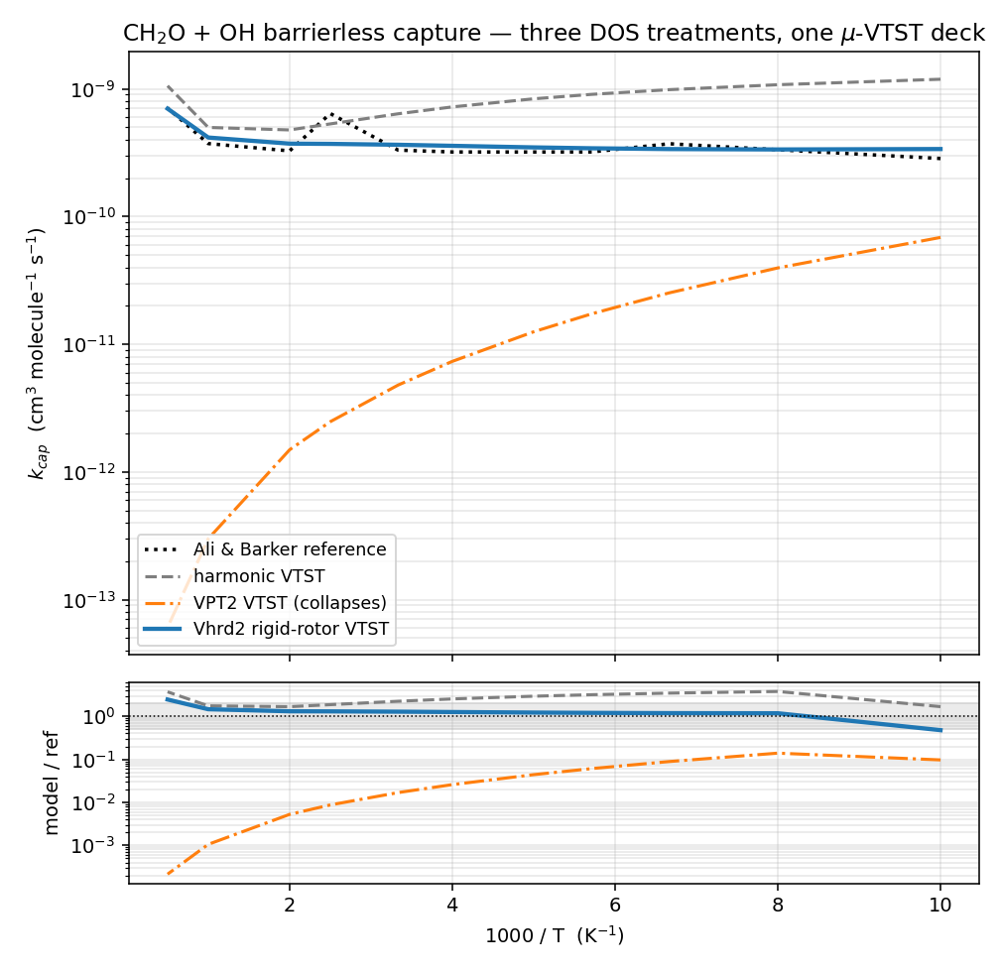

# VTST example — CH₂O + OH barrierless capture: harmonic vs VPT2 vs Vhrd2

Companion to the [`ktools`](../ktools) example. That one shows how gausskit writes a **harmonic**
µ-VTST deck for the barrierless OH-addition entrance. This one asks the next question: the
transitional modes of a loose entrance are **very soft** (large-amplitude fragment librations,
20–40 cm⁻¹) — how should their density of states be treated, and does it matter?

Answer: it matters by **orders of magnitude**, and the right treatment is a **scan-matched rigid
rotor (Vhrd2)**, not VPT2.



| treatment (same deck, same engine) | k(100 K) | geomean k/reference (100–2000 K) |
|---|---:|---:|
| harmonic VTST | 1.19e-9 | **2.5×** (overshoots — no anharmonic ceiling) |
| VPT2 VTST | 6.9e-11 | **0.016×** (collapses — up to 1000× low) |
| **Vhrd2 rigid-rotor VTST** | 3.38e-10 | **1.23×** (recovers the reference) |

Reference: Ali & Barker, *J. Phys. Chem. A* **2015**, *119*, 7578 (`reference_capture.csv`).

## The physics — why VPT2 collapses and the rotor recovers

The entrance channel CH₂O + OH → [CH₂O···HO] has **no barrier**; the rate is set by a variational
bottleneck that moves inward as T rises (~5.4 Å at 100 K → ~1.9 Å hot). At every trial dividing
surface the two lowest modes are **hindered rotations of the OH fragment about the complex** — soft,
anharmonic, and (crucially) *bounded*: the OH can swing through large angles but the well has a top.

- **Harmonic** treats each soft mode as an infinite parabola. That has no top, so it over-counts
  states at the energies that matter → the rate overshoots ~2×.
- **VPT2** adds the leading anharmonic correction as a *perturbation*. For these modes |X/ω| ≳ 1:
  the expansion is past its radius of convergence. Worse, on this deck a valid VPT2 density of
  states (`bdens`) could be computed **on only one surface** (rp_25, the innermost); every looser
  surface has soft modes so anharmonic that no VPT2 `.dens` exists at all. Feeding VPT2 where it
  *is* computable truncates that one surface's DOS so hard that it becomes a **spurious bottleneck**,
  dragging the whole rate down 60–1000×. That collapse is not physics — it is the perturbation
  series diverging.
- **Vhrd2** replaces each soft mode with a **1D hindered rotor whose potential is read off a real
  Gaussian scan** (rotate the fragment, solve the periodic-rotor DVR exactly). No perturbation, no
  truncation — the bounded well is represented directly. The rate lands on the reference to ~1.2×.

This is the barrierless-entrance counterpart to the tight-TS
[`na_rigid_rotor_validation`](../../../na_rigid_rotor_validation) result: there the soft modes are
*rectilinear* rattling wells (mode-scan) and VPT2 also fails; here they are genuine *curvilinear*
fragment rotations, so the **rigid-rotor** coordinate is the physically correct scan. `gausskit
utils rotor` classifies which of the two each mode is by character (`rot_frac`); on this loose
entrance every soft mode is a pure rotation (`rot_frac = 1.00`).

## What this example ships

The full campaign (37 rotor scans on 11 surfaces, submitted to a cluster, fit with
`gausskit utils rotor {detect,scan,fit}`) lives in the project's
`multiwell_ktools_example_ch2o_oh/` directory. This example ships only the **end products** needed
to reproduce the three k(T) curves locally in seconds:

| file | role |
|---|---|
| `ktools_harm11.dat` | the 11-surface µ-VTST deck (2.5→5.5 Å), harmonic backbone |
| `dens/rp_NN_modeaware.dens` (×11) | the Vhrd2 rigid-rotor DOS per surface (soft modes as scanned rotors, stiff modes harmonic) |
| `dens/rp_25_vpt2.dens` | the *one* surface where a valid VPT2 DOS exists (`bdens`) |
| `vtst_modeaware.args` | the `--dens/--zpe-shift` map wiring each surface's rotor DOS + its anharmonic-ZPE reference into the engine |
| `reference_capture.csv` | Ali & Barker's published capture rate |

`.dens` files are ground-referenced, so each carries a `--zpe-shift` = Σ(E₀ − ½ω) to put its
surface back on the common potential-energy zero (the physical rotors sit near the harmonic ZPE,
±100 cm⁻¹; the VPT2 surface is shifted −183 cm⁻¹).

## The engine

All three curves go through **`gausskit vtst`** — gausskit's pure-Python µ-VTST engine. It reads the
same `ktools.dat` deck the native solver would, computes the J-resolved variational capture rate,
and (with `--dens NAME=PATH`) swaps an external DOS in for any trial surface. No MultiWell binary is
needed — the example is fully offline and reproducible.

> Why the Python engine and not native KTOOLS? Native KTOOLS **segfaults** on a Vhrd2 deck (its
> `uhrlev` level array `ev(2000)` overflows for these dense rotor ladders). The Python engine
> reproduces native harmonic KTOOLS to <1% at high T (~1.4× at 100 K, where the engine lacks the
> unified statistical model), so the honest headline is the **within-engine move 2.5× → 1.2×** as
> the soft-mode DOS goes harmonic → Vhrd2.

## Run

```sh
make rates    # three gausskit vtst runs -> rates/engine_{harmonic,vpt2,modeaware}.csv
make plot     # + plot_kt.py -> kt.png
make clean
```

`make plot` prints the geomean-vs-reference for each curve. Requires `gausskit` on PATH and
matplotlib; no Gaussian or MultiWell run.

## Takeaway

On a barrierless entrance, the soft transitional modes decide the rate, and how you count their
states is not a detail:

- harmonic has no anharmonic ceiling → overshoots,
- VPT2 is past its convergence radius → collapses (and often can't be computed at all),
- the **scan-matched rigid rotor represents the bounded well directly** → recovers the reference.

This is the treatment gausskit uses for barrierless capture channels — the same one carried into
the PFOS work.
